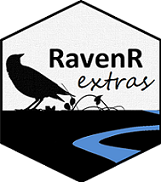

README
================


[](https://choosealicense.com/)

# RavenR.extras 

RavenR.extras is an R package for bolstering the functions distributed 
in the RavenR package, which aids the usage of the Raven Hydrologic 
Modelling Framework. Please contact Robert Chlumsky
(<rchlumsk@uwaterloo.ca>) or Dr. James Craig (<jrcraig@uwaterloo.ca>)
for any troubleshooting, bug fixes, or recommendations on future
releases.

## Installation

The RavenR.extras package may be installed with `devtools` from Github.

``` r
# install.packages("devtools")
library(devtools)
devtools::install_github("rchlumsk/RavenR.extras")
```

RavenR may be installed through CRAN or Github.
``` r
# CRAN installation
install.packages("RavenR")

## Github Installation
# install.packages("devtools")
library(devtools)
devtools::install_github("rchlumsk/RavenR")
```

## Tutorials and Quick Start Guide

Please see the vignettes folder for RavenR-related tutorials and guides.
Additional materials may be found on the [Raven webpage](http://raven.uwaterloo.ca/RavenR.html).

\*\*Note that as of v1.2, the vignettes are out of date and will be
updated in the next update.

## RavenR.extras Wishlist

Any issues or feature requests can be submitted on Github via the Issues
tab. You may also submit feature requests directly to Robert Chlumsky
(<rchlumsk@uwaterloo.ca>) via email.

